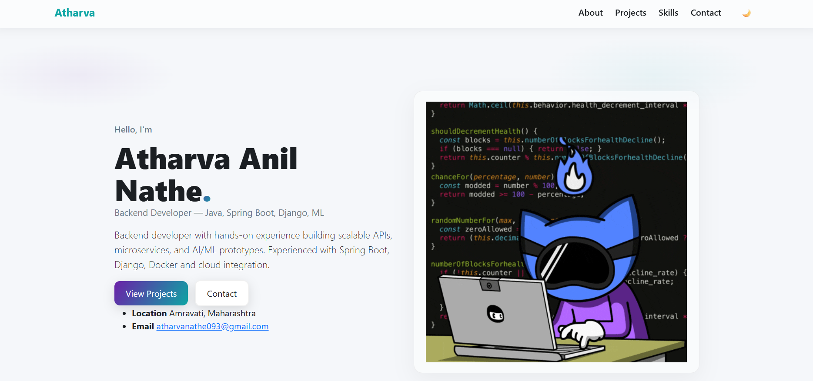

# Portfolio Website — Atharva Anil Nathe

---

## 🌟 Project Overview

A **modern, professional portfolio website** to showcase skills, projects, experience, and contact information.  
Designed with **glassmorphism, gradients, bold typography, and subtle 3D hover effects**.

**Key Features:**
- Hero section with interactive CTA buttons
- About section with experience and objective
- Projects showcase in responsive 3D cards
- Skills section with hover effects
- Contact section
- Gradient buttons with light/dark theme
- Fully responsive design

---

## 🛠️ Technologies Used

- **Backend:** Django 5.2.8, Python 3.12
- **Frontend:** HTML5, CSS3, JavaScript
- **Styling & UI:** Bootstrap 5, Custom CSS (glass + gradients + 3D hover)
- **Version Control:** Git & GitHub

---

## 📁 Project Structure

portfolio_site/
│
├── portfolio/
│ ├── templates/
│ │ └── portfolio/
│ │ ├── base.html
│ │ └── index.html
│ ├── static/
│ │ └── portfolio/
│ │ ├── css/style.css
│ │ ├── js/main.js
│ │ └── img/hero-graphic.svg
│ └── views.py
├── portfolio_site/
│ ├── settings.py
│ ├── urls.py
│ └── wsgi.py
├── manage.py
└── README.md

---

## 📸 Screenshots

**Homepage:**

---

## 📌 Credits

Developed by Atharva Anil Nathe

## 📄 License

This project is open-source and licensed under the MIT License
.

## 🔗 Links

Portfolio Live Demo: Soon...

